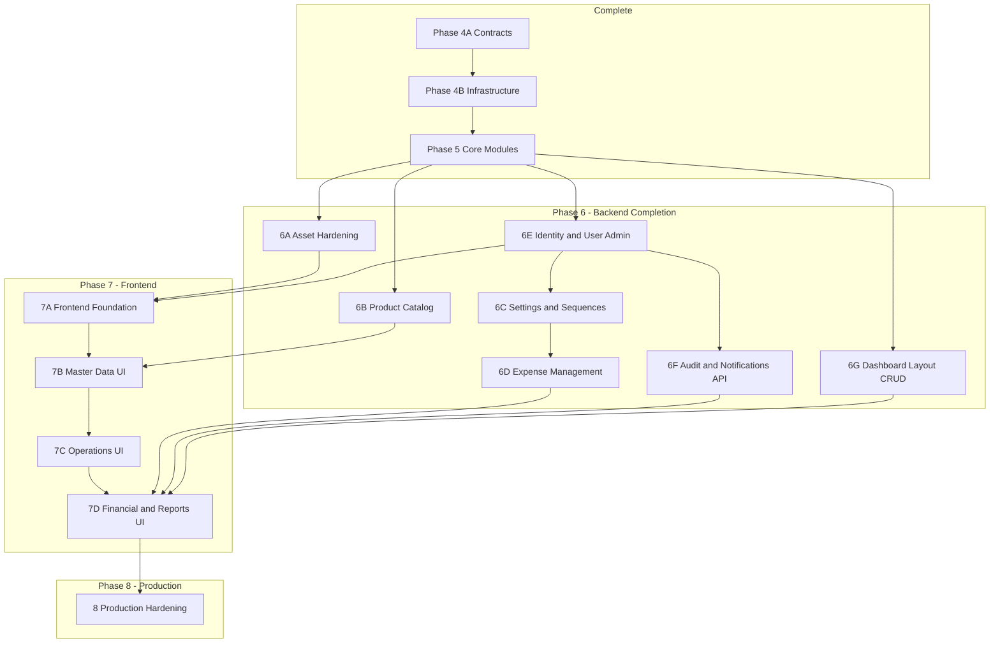

# ERP Remaining Roadmap

**Project:** Enterprise Rental ERP (Manyar Tent Service)  
**Repository path:** `rental-erp/`  
**Document version:** 1.0  
**Baseline:** Complete through **Phase 5-020** (per `docs/ERP_MASTER_SPEC.md`)  
**Last verified:** July 10, 2026  
**Purpose:** Official source of truth for all **remaining** development. Every future Cursor session should reference this document alongside `docs/ERP_MASTER_SPEC.md`.

**Companion docs:**
- `docs/ERP_MASTER_SPEC.md` — architecture, conventions, completed modules
- `docs/architecture/phase-4b-infrastructure.md` — shared infrastructure deep dive

---

## Status Legend

| Symbol | Meaning |
|--------|---------|
| ✅ | **Complete** — all layers, APIs, and tests in place per project standards |
| 🟡 | **Partial** — some layers or capabilities exist; gaps remain |
| ⬜ | **Not Started** — schema/permissions may exist; no module implementation |

**Priority scale:** High / Medium / Low  
**Effort scale:** S (1–3 days) · M (4–8 days) · L (9–15 days) · XL (16+ days) — single developer, mirroring existing module patterns

---

## Executive Summary

| Area | Completion | Notes |
|------|------------|-------|
| Shared infrastructure (Phase 4B) | ✅ 100% | DI, UoW, audit write, notifications infra, storage |
| Core business modules (Phase 5) | ✅ 100% | 17 modules with full stack + tests |
| Asset module (post-Phase 5) | 🟡 ~85% | Full code + API; **zero tests**; no accounting integration |
| Platform admin modules | ⬜ ~5% | Permissions/schema only |
| Cross-cutting read APIs | 🟡 ~30% | Audit write ✅; read APIs missing |
| Notifications in workflows | ⬜ 0% | Infra exists; never called from feature modules |
| Frontend UI | ⬜ ~10% | App shell only; no feature pages |
| Production hardening | ⬜ ~20% | Soft delete, S3, CI env, identity reconciliation pending |

**Overall backend (Phase 5 scope):** ~95% complete  
**Overall enterprise system (incl. UI + platform):** ~55–60% complete

### Critical Technical Debt (must address before production)

1. **Dual user model** — better-auth `user` table (TEXT id, `role` string) vs ERP `users`/`roles` tables (UUID, `roleId` FK). Migrations are inconsistent: some FKs reference `user`, others reference `users`. No `users`/`roles` migration exists.
2. **Asset module untested** — 71 source files, 0 test files, excluded from `vitest.config.ts` coverage.
3. **Permissions without routes** — `identity:*`, `catalog:*`, `expenses:*`, `audit:read`, `notifications:*`, `settings:manage` defined but unused.
4. **21 test files require `.env`** — API and Prisma repo tests fail without `DATABASE_URL` / `BETTER_AUTH_SECRET` in CI.

---

## Part 1 — Completed Work

### Phase 4A — Application Contracts ✅

| Deliverable | Status |
|-------------|--------|
| RequestContext / ExecutionContext | ✅ |
| Query builders (pagination, sort, filter) | ✅ |
| Validation (`parseRequest`, common schemas) | ✅ |
| Authorization (`PERMISSIONS`, `assertPermission`, roles) | ✅ |

### Phase 4B — Shared Infrastructure ✅

| Deliverable | Status |
|-------------|--------|
| SharedDeps composition root | ✅ |
| RepositoryRunner + ObservableRepositoryRunner | ✅ |
| Unit of Work | ✅ |
| TransactionManager | ✅ |
| Prisma error mapping | ✅ |
| Audit logging (write) | ✅ |
| Notification service (enqueue) | ✅ |
| File storage (local adapter) | ✅ |
| Query/pagination infrastructure | ✅ |

### Phase 5 — Core Business Modules ✅

| Phase | Module | API Base | Tests |
|-------|--------|----------|-------|
| 5-002 | Customer | `/api/customers` | 5 files |
| 5-003 | Supplier | `/api/suppliers` | 5 files |
| 5-004 | Warehouse | `/api/warehouses` | 5 files |
| 5-005 | Product | `/api/products` | 5 files |
| 5-008 | Inventory | `/api/inventory` | 5 files |
| 5-009 | Stock Movement | `/api/stock-movements` | 5 files |
| 5-010 | Procurement | `/api/purchase-orders` | 8 files |
| 5-011 | Rental Orders | `/api/rental-orders` | 8 files |
| 5-012 | Dispatch | `/api/dispatches` | 8 files |
| 5-013 | Returns | `/api/returns` | 7 files |
| 5-014 | Repair | `/api/repairs` | 7 files |
| 5-015 | Maintenance | `/api/maintenances` | 7 files |
| 5-016 | Rental Invoice | `/api/rental-invoices` | 7 files |
| 5-017 | Payments | `/api/payments` | 7 files |
| 5-018 | Accounting | `/api/accounts`, `/api/journal-entries` | 12 files |
| 5-019 | Financial Reports | `/api/financial-reports/*` (10 endpoints) | 14 files |
| 5-020 | Reporting + Dashboard summary | `/api/reports/*` (12 endpoints) | 12 files |

### Cross-Cutting (Operational) ✅

| Concern | Status | Location |
|---------|--------|----------|
| Authentication (login/session) | ✅ | `src/lib/auth/` |
| RBAC enforcement on all Phase 5 APIs | ✅ | Route runners + `authorize.ts` |
| Audit write path | ✅ | All write services |

**API route count:** 86 `route.ts` files (78 Phase 5 business + 8 asset + auth catch-all)

---

## Part 2 — Partially Complete Work

### Phase 6A — Asset Management 🟡

**Status:** Code and API implemented; quality gate and enterprise integrations incomplete.

| Layer | Status | Evidence |
|-------|--------|----------|
| Domain | ✅ | `asset.entity.ts`, `asset-category.entity.ts`, rules, depreciation logic |
| Application | ✅ | 12 services, schemas, mappers, transaction runners, audit mappers |
| Infrastructure | ✅ | Prisma repos, persistence mappers, factories |
| Presentation | ✅ | Route runners, API handlers, response mappers |
| API routes | ✅ | `/api/assets`, `/api/asset-categories` (+ transfer, dispose, maintenance) |
| Tests | ❌ | **0 test files** |
| Vitest coverage | ❌ | Excluded from `vitest.config.ts` |

**API inventory:**

| Method | Path |
|--------|------|
| GET, POST | `/api/assets` |
| GET, PATCH | `/api/assets/:id` |
| POST | `/api/assets/:id/transfer` |
| POST | `/api/assets/:id/dispose` |
| POST | `/api/assets/:id/maintenance` |
| GET, POST | `/api/asset-categories` |
| GET, PATCH, DELETE | `/api/asset-categories/:id` |

**Remaining gaps:**
- Full test suite (domain, validation, application, API, in-memory repo)
- Depreciation schedule/run service (domain logic exists; no posting workflow)
- Accounting integration (asset acquisition / disposal journal entries)
- Vitest coverage registration

| Attribute | Value |
|-----------|-------|
| Dependencies | Warehouse, Supplier, User (ERP FK tension) |
| Business priority | Medium — fixed assets secondary to rental ops |
| Technical priority | **High** — untested production code |
| Effort to complete | **M** (4–6 days) |

---

### Phase 6F — Platform Observability 🟡

#### Audit (read path)

| Capability | Status |
|------------|--------|
| Write (`PrismaAuditLogger`) | ✅ All modules |
| Read API (`audit:read`) | ❌ No `/api/audit` |
| Audit query module | ❌ |

#### Notifications

| Capability | Status |
|------------|--------|
| Enqueue infra (`PrismaNotificationService`) | ✅ |
| Template resolution | ✅ |
| Channel adapters (email, SMS, etc.) | ❌ Placeholder only |
| Read/send API (`notifications:read/send`) | ❌ |
| Workflow integration | ❌ Zero `notificationService.enqueue()` calls in feature modules |

| Attribute | Value |
|-----------|-------|
| Dependencies | Identity module (admin send permissions) |
| Business priority | Medium — compliance and user alerts |
| Technical priority | Medium |
| Effort | **M** (5–7 days) |

---

### Phase 6G — Dashboard & Analytics 🟡

| Capability | Status |
|------------|--------|
| Operational dashboard summary | ✅ `GET /api/reports/dashboard` |
| 11 entity reports | ✅ `/api/reports/*` |
| 10 financial reports | ✅ `/api/financial-reports/*` |
| Dashboard layout CRUD | ❌ `Dashboard`, `DashboardWidget`, `UserDashboard` models unused |
| Configurable widgets | ❌ |
| User dashboard preferences | ❌ |

| Attribute | Value |
|-----------|-------|
| Dependencies | Reporting module (complete) |
| Business priority | Low — summary dashboard sufficient for MVP |
| Technical priority | Low |
| Effort | **M** (5–8 days) |

---

### Phase 7 — Frontend 🟡 (~10%)

| Capability | Status |
|------------|--------|
| App shell (sidebar, topbar) | ✅ |
| shadcn/ui primitives | ✅ |
| Login / logout / unauthorized pages | ✅ |
| Feature pages | ❌ |
| Navigation wiring | ❌ All `href: "#"` placeholders |
| Route protection middleware | ❌ |
| API integration (data fetching) | ❌ |

**Pages that exist:** `/`, `/login`, `/logout`, `/unauthorized` (4 total)

| Attribute | Value |
|-----------|-------|
| Dependencies | Stable backend APIs (Phase 5 ✅; Phase 6 recommended first) |
| Business priority | **High** — system unusable without UI |
| Technical priority | **High** |
| Effort | **XL** (30–50 days for full module coverage) |

---

## Part 3 — Missing Enterprise Modules

Modules where Prisma schema and/or permissions exist but **no feature module** is implemented.

| Module | Prisma Models | Permissions | Module Path | API Routes |
|--------|---------------|-------------|-------------|------------|
| **Expense** | `Expense`, `ExpenseCategory` | `expenses:read/create/update` | ❌ | ❌ (`/api/financial-reports/expenses` reads journals, not `Expense` table) |
| **Product Catalog** | `Category` | `catalog:read/create/update/delete` | ❌ | ❌ (product API ignores `categoryId`) |
| **Identity / User Admin** | `User`, `Role` (ERP) | `identity:read/create/update/delete` | ❌ | ❌ (better-auth only) |
| **Settings** | `CompanySetting`, `DocumentSequence`, `SystemSetting`, `FeatureFlag` | `settings:manage` | ❌ | ❌ |
| **Audit Query** | `AuditLog` | `audit:read` | ❌ (infra only) | ❌ |
| **Notifications API** | `Notification`, `NotificationTemplate`, `NotificationRecipient` | `notifications:read/send` | ❌ (infra only) | ❌ |

### Additional gaps (no schema module yet)

| Capability | Status | Notes |
|------------|--------|-------|
| Soft delete | ⬜ | Commented as future phase in schema |
| S3 file storage | ⬜ | Stub throws "not implemented yet" |
| Auto journal posting | ⬜ | Payments/invoices don't auto-create journal entries |
| Document numbering service | ⬜ | `DocumentSequence` model exists; no service uses it |
| CI test environment | ⬜ | 21 test suites fail without `.env` |

---

## Part 4 — Remaining Phases (Dependency-Ordered)

Phases are numbered for planning. **Execution order should follow the dependency column**, not necessarily numeric order.

---

### Phase 6A — Asset Hardening 🟡

**Goal:** Bring asset module to the same quality bar as Phase 5 modules.

| Deliverable | Status |
|-------------|--------|
| Domain/application/infrastructure/presentation | ✅ |
| REST API (assets + categories) | ✅ |
| Test suite (domain, validation, application, API, in-memory repo) | ⬜ |
| Vitest coverage inclusion | ⬜ |
| Optional: depreciation posting service | ⬜ |
| Optional: accounting journal integration on acquire/dispose | ⬜ |

| Attribute | Value |
|-----------|-------|
| Dependencies | Phase 5 complete |
| Blocks | Phase 7 asset UI pages |
| Business priority | Medium |
| Technical priority | **High** (untested code in production path) |
| Effort | **M** (4–6 days) |

---

### Phase 6E — Identity & User Administration ⬜

**Goal:** Reconcile better-auth with ERP user model; enable admin user management.

| Deliverable | Status |
|-------------|--------|
| Resolve `user` vs `users`/`roles` schema tension | ⬜ |
| Migration for ERP `users`/`roles` OR unify on better-auth `user` | ⬜ |
| Fix inconsistent FK references across migrations | ⬜ |
| Identity module (list/create/update/deactivate users) | ⬜ |
| Role assignment API | ⬜ |
| Enforce `identity:*` permissions | ⬜ |
| Map session `user.id` → ERP audit FK consistently | ⬜ |

| Attribute | Value |
|-----------|-------|
| Dependencies | Phase 5 complete |
| Blocks | Phase 6C (settings audit), Phase 6F (notification admin), Phase 7 (protected routes), production |
| Business priority | **High** — multi-user operations require admin |
| Technical priority | **Critical** — schema/FK inconsistency |
| Effort | **L** (8–12 days) |

**Recommended approach:** Audit all `createdById` / `recordedById` FKs; choose single canonical user table; add bridge or migration; then build identity module mirroring `customer` CRUD pattern.

---

### Phase 6C — Settings & Document Sequences ⬜

**Goal:** Company configuration, system settings, feature flags, and auto-numbering for business documents.

| Deliverable | Status |
|-------------|--------|
| Company settings CRUD | ⬜ |
| System settings management | ⬜ |
| Feature flag management | ⬜ |
| Document sequence service (RENTAL_ORDER, PAYMENT, DISPATCH, EXPENSE, etc.) | ⬜ |
| `settings:manage` permission enforcement | ⬜ |
| Integrate sequences into existing modules (invoice numbers, PO numbers, etc.) | ⬜ |

| Attribute | Value |
|-----------|-------|
| Dependencies | Phase 6E (identity for `settings:manage` admin) |
| Blocks | Phase 6D (expense numbering), production document numbering |
| Business priority | **High** — document numbers required for operations |
| Technical priority | **High** |
| Effort | **L** (10–14 days) |

**Prisma models:** `CompanySetting`, `DocumentSequence`, `SystemSetting`, `FeatureFlag`

---

### Phase 6B — Product Catalog (Categories) ⬜

**Goal:** Standalone CRUD for product `Category`; wire `categoryId` through product API.

| Deliverable | Status |
|-------------|--------|
| Category module (CRUD) | ⬜ |
| `/api/categories` routes | ⬜ |
| `catalog:*` permission enforcement | ⬜ |
| Add `categoryId` to product create/update schemas | ⬜ |
| Product list filter by category | ⬜ |
| Full test suite | ⬜ |

| Attribute | Value |
|-----------|-------|
| Dependencies | Phase 5 product module |
| Blocks | Phase 7B product UI enhancements |
| Business priority | Medium |
| Technical priority | Low |
| Effort | **S** (2–4 days) |

**Note:** `AssetCategory` is already managed under the asset module. This phase covers **product** `Category` only.

---

### Phase 6D — Expense Management ⬜

**Goal:** Operational expense recording separate from journal-based expense summaries.

| Deliverable | Status |
|-------------|--------|
| Expense module (CRUD) | ⬜ |
| `/api/expenses` routes | ⬜ |
| `expenses:*` permission enforcement | ⬜ |
| Document numbering via Phase 6C sequences | ⬜ |
| Optional: auto journal entry on expense post | ⬜ |
| Update financial-report expense summary to include `Expense` table | ⬜ |
| Full test suite | ⬜ |

| Attribute | Value |
|-----------|-------|
| Dependencies | Phase 6C (document sequences), Phase 5 accounting |
| Blocks | Phase 7D expense UI |
| Business priority | **High** — daily operational expenses |
| Technical priority | Medium |
| Effort | **M** (5–8 days) |

**Prisma model:** `Expense` with `ExpenseCategory` enum (RENT, SALARY, REPAIR, OFFICE, PURCHASE, UTILITY, TRANSPORT, MISCELLANEOUS)

---

### Phase 6F — Audit & Notifications APIs ⬜

**Goal:** Expose read/send capabilities; wire notifications into business workflows.

| Deliverable | Status |
|-------------|--------|
| Audit read module (`GET /api/audit-logs`) | ⬜ |
| Paginated audit query (entity, user, date, action filters) | ⬜ |
| Notifications read API (`GET /api/notifications`) | ⬜ |
| Notifications send/mark-read API | ⬜ |
| Channel adapter stubs (email at minimum) | ⬜ |
| Wire `notificationService.enqueue()` into key workflows (invoice issued, payment posted, dispatch completed, low stock) | ⬜ |
| Seed notification templates | ⬜ |
| Full test suite | ⬜ |

| Attribute | Value |
|-----------|-------|
| Dependencies | Phase 6E (identity admin for send permissions) |
| Blocks | Phase 7D admin/notification UI |
| Business priority | Medium |
| Technical priority | Medium |
| Effort | **M** (6–9 days) |

---

### Phase 6G — Dashboard Layout Management ⬜

**Goal:** Configurable dashboards with widgets and per-user layouts.

| Deliverable | Status |
|-------------|--------|
| Dashboard CRUD module | ⬜ |
| Widget configuration API | ⬜ |
| UserDashboard preferences (favorite, default, custom layout) | ⬜ |
| Widget data resolvers linking to existing report services | ⬜ |
| Full test suite | ⬜ |

| Attribute | Value |
|-----------|-------|
| Dependencies | Phase 5 reporting (summary exists) |
| Blocks | Phase 7 customizable dashboard UI |
| Business priority | Low |
| Technical priority | Low |
| Effort | **M** (5–8 days) |

**Prisma models:** `Dashboard`, `DashboardWidget`, `UserDashboard`, `WidgetType` enum

---

### Phase 7A — Frontend Foundation ⬜

**Goal:** Authenticated app shell with real navigation and API client patterns.

| Deliverable | Status |
|-------------|--------|
| Route protection middleware / layout guards | ⬜ |
| Wire `NAVIGATION_ITEMS` to real routes | ⬜ |
| Shared API client (fetch wrapper, error handling, auth cookies) | ⬜ |
| Reusable data table / form / pagination components | ⬜ |
| Role-based nav visibility | ⬜ |
| Toast/error display (sonner integration) | ⬜ |

| Attribute | Value |
|-----------|-------|
| Dependencies | Phase 6E (identity for role-aware UI) |
| Blocks | All Phase 7B/C/D pages |
| Business priority | **High** |
| Technical priority | **High** |
| Effort | **M** (6–8 days) |

---

### Phase 7B — Master Data UI ⬜

**Goal:** UI for foundational entities.

| Pages | API (exists) |
|-------|-------------|
| Customers | `/api/customers` ✅ |
| Suppliers | `/api/suppliers` ✅ |
| Warehouses | `/api/warehouses` ✅ |
| Products | `/api/products` ✅ |
| Categories | `/api/categories` ⬜ (Phase 6B) |
| Inventory | `/api/inventory` ✅ |
| Assets | `/api/assets` ✅ |
| Asset Categories | `/api/asset-categories` ✅ |

| Attribute | Value |
|-----------|-------|
| Dependencies | Phase 7A, Phase 6B (categories) |
| Business priority | **High** |
| Technical priority | Medium |
| Effort | **L** (10–14 days) |

---

### Phase 7C — Operations UI ⬜

**Goal:** UI for rental lifecycle and inventory operations.

| Pages | API (exists) |
|-------|-------------|
| Purchase Orders | `/api/purchase-orders` ✅ |
| Rental Orders | `/api/rental-orders` ✅ |
| Dispatches | `/api/dispatches` ✅ |
| Returns | `/api/returns` ✅ |
| Repairs | `/api/repairs` ✅ |
| Maintenances | `/api/maintenances` ✅ |
| Stock Movements | `/api/stock-movements` ✅ |

| Attribute | Value |
|-----------|-------|
| Dependencies | Phase 7B (master data lookups) |
| Business priority | **Critical** — core business operations |
| Technical priority | **High** |
| Effort | **XL** (16–22 days) |

---

### Phase 7D — Financial & Reports UI ⬜

**Goal:** UI for billing, accounting, expenses, and analytics.

| Pages | API (exists) |
|-------|-------------|
| Rental Invoices | `/api/rental-invoices` ✅ |
| Payments | `/api/payments` ✅ |
| Accounts | `/api/accounts` ✅ |
| Journal Entries | `/api/journal-entries` ✅ |
| Expenses | `/api/expenses` ⬜ (Phase 6D) |
| Financial Reports (10) | `/api/financial-reports/*` ✅ |
| Operational Reports (12) | `/api/reports/*` ✅ |
| Dashboard | `/api/reports/dashboard` ✅ |
| Audit Logs | `/api/audit-logs` ⬜ (Phase 6F) |
| Settings | `/api/settings` ⬜ (Phase 6C) |
| User Admin | `/api/users` ⬜ (Phase 6E) |

| Attribute | Value |
|-----------|-------|
| Dependencies | Phase 7C, Phase 6C/6D/6E/6F |
| Business priority | **High** |
| Technical priority | Medium |
| Effort | **XL** (14–20 days) |

---

### Phase 8 — Production Hardening ⬜

**Goal:** Enterprise production readiness.

| Deliverable | Status |
|-------------|--------|
| Soft delete (`deletedAt`, `deletedBy`) across master data | ⬜ |
| S3/cloud file storage adapter | ⬜ |
| CI pipeline with test `.env` / mocked env for 21 failing suites | ⬜ |
| Auto journal posting (payment → cash/receivable; invoice → revenue) | ⬜ |
| Database seed scripts for roles, default accounts, templates | ⬜ |
| API rate limiting / request validation hardening | ⬜ |
| Observability (structured logging, health checks) | ⬜ |
| Migration cleanup (unify user FK references) | ⬜ |
| Performance indexes review | ⬜ |
| Security audit (RBAC coverage, input sanitization) | ⬜ |

| Attribute | Value |
|-----------|-------|
| Dependencies | Phases 6 and 7 substantially complete |
| Business priority | **High** for go-live |
| Technical priority | **High** |
| Effort | **L** (10–15 days) |

---

## Part 5 — Recommended Execution Order

Priority-ranked sequence for maximum dependency safety and business value:

| Order | Phase | Status | Rationale |
|-------|-------|--------|-----------|
| 1 | **6A** Asset Hardening | 🟡 | Quick win; closes test gap on existing code |
| 2 | **6E** Identity & User Admin | ⬜ | **Critical** — fixes user model; unblocks admin + UI auth |
| 3 | **6C** Settings & Sequences | ⬜ | Document numbering needed across modules |
| 4 | **6B** Product Catalog | ⬜ | Small, independent; improves product data |
| 5 | **6D** Expense Management | ⬜ | High business value; depends on 6C |
| 6 | **6F** Audit & Notifications API | ⬜ | Compliance and alerting |
| 7 | **6G** Dashboard Layout CRUD | ⬜ | Nice-to-have; summary already works |
| 8 | **7A** Frontend Foundation | ⬜ | Unblocks all UI work |
| 9 | **7B** Master Data UI | ⬜ | Foundational screens |
| 10 | **7C** Operations UI | ⬜ | **Highest business impact** UI |
| 11 | **7D** Financial & Reports UI | ⬜ | Completes user-facing system |
| 12 | **8** Production Hardening | ⬜ | Go-live readiness |

### Parallelization opportunities

| Can run in parallel | Condition |
|--------------------|-----------|
| 6A + 6E | Different developers; no file overlap |
| 6B + 6C | After 6E identity decision is made |
| 6F + 6G | After 6E complete |
| 7B + 7C | After 7A; different page groups |

---

## Part 6 — Effort Summary

| Phase | Status | Effort | Business Priority | Technical Priority |
|-------|--------|--------|-------------------|-------------------|
| 4A Application Contracts | ✅ | — | — | — |
| 4B Shared Infrastructure | ✅ | — | — | — |
| 5-002 → 5-020 Core Modules | ✅ | — | — | — |
| 6A Asset Hardening | 🟡 | M (4–6d) | Medium | **High** |
| 6B Product Catalog | ⬜ | S (2–4d) | Medium | Low |
| 6C Settings & Sequences | ⬜ | L (10–14d) | **High** | **High** |
| 6D Expense Management | ⬜ | M (5–8d) | **High** | Medium |
| 6E Identity & User Admin | ⬜ | L (8–12d) | **High** | **Critical** |
| 6F Audit & Notifications API | ⬜ | M (6–9d) | Medium | Medium |
| 6G Dashboard Layout CRUD | ⬜ | M (5–8d) | Low | Low |
| 7A Frontend Foundation | ⬜ | M (6–8d) | **High** | **High** |
| 7B Master Data UI | ⬜ | L (10–14d) | **High** | Medium |
| 7C Operations UI | ⬜ | XL (16–22d) | **Critical** | **High** |
| 7D Financial & Reports UI | ⬜ | XL (14–20d) | **High** | Medium |
| 8 Production Hardening | ⬜ | L (10–15d) | **High** | **High** |

**Total remaining estimate:** ~95–140 developer-days (single developer, following existing patterns)

---

## Part 7 — Module Completion Matrix

| Module / Capability | Domain | Application | Infrastructure | Presentation | API | Tests | Overall |
|---------------------|:------:|:-----------:|:--------------:|:------------:|:---:|:-----:|:-------:|
| Customer | ✅ | ✅ | ✅ | ✅ | ✅ | ✅ | ✅ |
| Supplier | ✅ | ✅ | ✅ | ✅ | ✅ | ✅ | ✅ |
| Warehouse | ✅ | ✅ | ✅ | ✅ | ✅ | ✅ | ✅ |
| Product | ✅ | ✅ | ✅ | ✅ | ✅ | ✅ | ✅ |
| Inventory | ✅ | ✅ | ✅ | ✅ | ✅ | ✅ | ✅ |
| Stock Movement | ✅ | ✅ | ✅ | ✅ | ✅ | ✅ | ✅ |
| Procurement | ✅ | ✅ | ✅ | ✅ | ✅ | ✅ | ✅ |
| Rental Order | ✅ | ✅ | ✅ | ✅ | ✅ | ✅ | ✅ |
| Dispatch | ✅ | ✅ | ✅ | ✅ | ✅ | ✅ | ✅ |
| Return | ✅ | ✅ | ✅ | ✅ | ✅ | ✅ | ✅ |
| Repair | ✅ | ✅ | ✅ | ✅ | ✅ | ✅ | ✅ |
| Maintenance | ✅ | ✅ | ✅ | ✅ | ✅ | ✅ |
| Rental Invoice | ✅ | ✅ | ✅ | ✅ | ✅ | ✅ | ✅ |
| Payment | ✅ | ✅ | ✅ | ✅ | ✅ | ✅ | ✅ |
| Accounting | ✅ | ✅ | ✅ | ✅ | ✅ | ✅ | ✅ |
| Financial Report | ✅ | ✅ | ✅ | ✅ | ✅ | ✅ | ✅ |
| Reporting | ✅ | ✅ | ✅ | ✅ | ✅ | ✅ | ✅ |
| **Asset** | ✅ | ✅ | ✅ | ✅ | ✅ | ❌ | 🟡 |
| Product Catalog | ⬜ | ⬜ | ⬜ | ⬜ | ⬜ | ⬜ | ⬜ |
| Expense | ⬜ | ⬜ | ⬜ | ⬜ | ⬜ | ⬜ | ⬜ |
| Identity / Users | ⬜ | ⬜ | ⬜ | ⬜ | ⬜ | ⬜ | ⬜ |
| Settings | ⬜ | ⬜ | ⬜ | ⬜ | ⬜ | ⬜ | ⬜ |
| Audit (read) | ⬜ | ⬜ | ⬜ | ⬜ | ⬜ | ⬜ | ⬜ |
| Notifications (API) | ⬜ | ⬜ | ⬜ | ⬜ | ⬜ | ⬜ | ⬜ |
| Dashboard Layout | ⬜ | ⬜ | ⬜ | ⬜ | ⬜ | ⬜ | ⬜ |
| Frontend UI | ⬜ | — | — | 🟡 | — | ⬜ | 🟡 |
| Auth (login) | — | — | ✅ | ✅ | ✅ | ⬜ | ✅ |
| RBAC | ✅ | ✅ | — | ✅ | ✅ | 🟡 | ✅ |
| Audit (write) | — | — | ✅ | — | — | 🟡 | ✅ |
| Notifications (enqueue) | — | — | ✅ | — | — | ⬜ | 🟡 |
| File Storage | — | — | 🟡 | — | — | ⬜ | 🟡 |

---

## Part 8 — Rules For Future Cursor Sessions

When implementing any remaining phase:

1. **Read both docs first:** `ERP_MASTER_SPEC.md` + this roadmap.
2. **Follow dependency order** in Part 5 unless the user explicitly overrides.
3. **Never skip tests** — Asset module is the cautionary example.
4. **Resolve identity (6E) before** building settings, expense numbering, or production deployment.
5. **Mirror existing patterns** — `customer` for CRUD, `repair` for workflows, `reporting` for read-only.
6. **Update this roadmap** when a phase moves from ⬜ → 🟡 → ✅.
7. **Update `ERP_MASTER_SPEC.md`** when a module reaches ✅ complete status.

### Phase completion checklist

A phase is **✅ Complete** only when ALL of the following are true:

- [ ] All layers present (domain, application, infrastructure, presentation)
- [ ] REST API routes wired with auth + RBAC
- [ ] Permissions added to `permissions.ts` and `role-permissions.ts`
- [ ] Audit logging on all write operations
- [ ] Test suite: domain, validation, application, API (+ in-memory repo minimum)
- [ ] Vitest coverage includes the module (where applicable)
- [ ] This roadmap updated

---

## Appendix A — Permissions Without Routes

| Permission | Intended Module | Phase |
|------------|-----------------|-------|
| `identity:read` | Identity admin | 6E |
| `identity:create` | Identity admin | 6E |
| `identity:update` | Identity admin | 6E |
| `identity:delete` | Identity admin | 6E |
| `catalog:read` | Product catalog | 6B |
| `catalog:create` | Product catalog | 6B |
| `catalog:update` | Product catalog | 6B |
| `catalog:delete` | Product catalog | 6B |
| `expenses:read` | Expense | 6D |
| `expenses:create` | Expense | 6D |
| `expenses:update` | Expense | 6D |
| `audit:read` | Audit query | 6F |
| `notifications:read` | Notifications | 6F |
| `notifications:send` | Notifications | 6F |
| `settings:manage` | Settings | 6C |

---

## Appendix B — Prisma Models Without Modules

| Model | Planned Phase |
|-------|---------------|
| `Category` (product) | 6B |
| `Expense` | 6D |
| `User`, `Role` (ERP) | 6E |
| `CompanySetting` | 6C |
| `DocumentSequence` | 6C |
| `SystemSetting` | 6C |
| `FeatureFlag` | 6C |
| `Dashboard` | 6G |
| `DashboardWidget` | 6G |
| `UserDashboard` | 6G |

---

*End of ERP Remaining Roadmap*
