# Phase 4B — Shared Infrastructure Architecture

**Status:** Complete (4B-001 through 4B-010)  
**Last verified against codebase:** Phase 4B-010 hardening pass  
**Scope:** Shared infrastructure under `src/shared/infrastructure/` — no feature modules, no business repositories

---

## Table of Contents

1. [Overview](#1-overview)
2. [Infrastructure Folder Structure](#2-infrastructure-folder-structure)
3. [Dependency Flow](#3-dependency-flow)
4. [Shared Dependency Composition](#4-shared-dependency-composition)
5. [Database Infrastructure](#5-database-infrastructure)
6. [Repository Foundation](#6-repository-foundation)
7. [Query Infrastructure](#7-query-infrastructure)
8. [Unit of Work](#8-unit-of-work)
9. [Audit Infrastructure](#9-audit-infrastructure)
10. [Notification Infrastructure](#10-notification-infrastructure)
11. [File Storage Infrastructure](#11-file-storage-infrastructure)
12. [Repository Observability](#12-repository-observability)
13. [Request Lifecycle](#13-request-lifecycle)
14. [Transaction Lifecycle](#14-transaction-lifecycle)
15. [Extension Guidelines](#15-extension-guidelines)
16. [Design Decisions](#16-design-decisions)
17. [Phase 4B Summary](#17-phase-4b-summary)

---

## 1. Overview

### Purpose of Phase 4B

Phase 4B implements the **shared infrastructure layer** for the Rental ERP system. Phase 4A established contracts, types, and application-layer utilities (context, query building, validation, authorization). Phase 4B provides **concrete implementations** behind those contracts: Prisma database access, audit logging, notification persistence, file storage, repository foundations, query/pagination helpers, unit-of-work coordination, dependency composition, and repository observability.

This phase delivers a **stable, reusable platform** that feature modules (Phase 5 and beyond) can build upon without re-implementing cross-cutting concerns.

### What Was Implemented

| Area | Implementation |
|------|----------------|
| Database | Prisma client singleton, transaction manager, error mapping, low-level DB helpers |
| Repository foundation | `RepositoryRunner`, `PrismaRepositoryBase`, CRUD helpers, factory functions |
| Query & pagination | `RepositoryQuerySpec`, Prisma query composition, paged query execution |
| Unit of Work | Transaction-scoped repository context, multi-repository coordination |
| Audit | `PrismaAuditLogger`, entry mapping, request metadata, transaction support |
| Notifications | `PrismaNotificationService`, template resolution, recipient persistence |
| File storage | `LocalFileStorage`, key/path normalization, provider factory |
| Dependency injection | `SharedDeps`, per-domain factories, composition root |
| Observability | Observable repository runner, timing, structured logging, metrics hook |
| Request utilities | Shared request log context for cross-cutting correlation |

### Why This Phase Exists Before Feature Modules

Feature repositories and application services depend on consistent answers to recurring questions:

- How is the Prisma client created and shared?
- How are database errors translated to application errors?
- How do multiple repositories participate in one transaction?
- How is audit context propagated from HTTP requests?
- How are notifications enqueued within a transaction?
- How are list endpoints paginated, filtered, sorted, and searched?

Building these foundations first prevents each feature module from inventing incompatible patterns. Phase 4B ensures that when Phase 5 adds the first concrete entity repository, it plugs into **existing factories and conventions** rather than ad-hoc Prisma calls.

---

## 2. Infrastructure Folder Structure

The shared infrastructure lives at:

```text
src/shared/infrastructure/
```

### Complete Structure

```text
src/shared/infrastructure/
├── index.ts                          # Top-level barrel (di, database, audit, notifications, storage, request)
│
├── di/                               # Dependency composition root
│   ├── container.ts                  # Composition root exports
│   ├── index.ts                      # Re-exports container
│   ├── shared-deps.ts                # SharedDeps aggregate + transaction helpers
│   ├── shared-database-deps.ts       # Prisma + TransactionManager
│   ├── shared-audit-deps.ts          # PrismaAuditLogger factory
│   ├── shared-notification-deps.ts   # PrismaNotificationService factory
│   └── shared-storage-deps.ts        # IFileStorage factory
│
├── database/                         # Database access layer
│   ├── index.ts                      # Database + repository barrel
│   ├── prisma-client.ts              # PrismaClient singleton (Pg adapter)
│   ├── prisma-types.ts               # DbClient, TransactionClient aliases
│   ├── prisma-error-mapper.ts        # Prisma → AppError translation
│   ├── repository-base.ts            # resolveDbClient, withPrismaError
│   ├── transaction-manager.ts        # ITransactionManager, PrismaTransactionManager
│   └── repository/                   # Repository foundation (see below)
│
├── database/repository/              # Repository patterns
│   ├── index.ts
│   ├── repository-types.ts           # Options, meta, execution context types
│   ├── repository-runner.ts          # RepositoryRunner (composition)
│   ├── prisma-repository-base.ts     # PrismaRepositoryBase (inheritance)
│   ├── create-repository-base.ts     # Factory functions
│   ├── repository-operations.ts      # CRUD helper functions
│   ├── query/                        # Query & pagination infrastructure
│   │   ├── query-specification.ts
│   │   ├── compose-prisma-query.ts
│   │   ├── build-search.ts
│   │   ├── merge-prisma-where.ts
│   │   ├── pagination-meta.ts
│   │   ├── execute-paged-query.ts
│   │   └── index.ts
│   ├── unit-of-work/                 # Transaction coordination
│   │   ├── unit-of-work-types.ts
│   │   ├── create-repository-unit-of-work-context.ts
│   │   ├── run-with-repository-unit-of-work.ts
│   │   ├── run-with-unit-of-work-repositories.ts
│   │   ├── repository-unit-of-work.ts
│   │   └── index.ts
│   └── observability/                # Repository metrics & logging
│       ├── repository-metrics.interface.ts
│       ├── repository-observation-context.ts
│       ├── repository-observation-meta.ts
│       ├── observable-repository-runner.ts
│       ├── create-observable-repository-runner.ts
│       └── index.ts
│
├── audit/                            # Audit logging infrastructure
│   ├── audit-logger.interface.ts     # IAuditLogger, AuditEntry, AuditContext
│   ├── audit-context.ts              # createAuditContext, mergeAuditContext
│   ├── audit-request-context.ts      # RequestContext → AuditContext
│   ├── audit-entry.mapper.ts         # Entry → Prisma create input
│   ├── audit-error-message.ts        # Failure message extraction
│   ├── prisma-audit-logger.ts        # PrismaAuditLogger implementation
│   └── index.ts
│
├── notifications/                    # Notification infrastructure
│   ├── notification-service.interface.ts
│   ├── notification-types.ts
│   ├── notification-payload.mapper.ts
│   ├── notification-template-resolver.ts
│   ├── notification-request-context.ts
│   ├── prisma-notification-service.ts
│   ├── channels/.gitkeep             # Placeholder for future channel adapters
│   └── index.ts
│
├── storage/                          # File storage infrastructure
│   ├── file-storage.interface.ts     # IFileStorage contract
│   ├── storage-types.ts
│   ├── storage-key.ts                # Key normalization & upload validation
│   ├── storage-path.ts               # Path resolution & public URL building
│   ├── storage-error-mapper.ts
│   ├── storage-request-context.ts
│   ├── create-file-storage.ts        # Provider factory (local / s3 stub)
│   ├── adapters/
│   │   ├── local-file-storage.ts
│   │   └── .gitkeep
│   └── index.ts
│
├── request/                          # Shared request-scoped utilities
│   ├── request-log-context.ts        # createRequestLogContext
│   └── index.ts
│
├── errors/                           # Application error types (supporting)
├── logging/                          # ILogger implementations (supporting)
└── http/                             # Route wrapper, API responses (supporting)
```

> **Note:** `errors/`, `logging/`, and `http/` are supporting modules used throughout Phase 4B infrastructure. They are not Phase 4B milestone deliverables themselves but are referenced by database, audit, notification, storage, and observability code.

### Folder Responsibilities

| Folder | Responsibility |
|--------|----------------|
| **`di/`** | Composition root. Aggregates domain-specific factories into `SharedDeps`. Provides request-scoped and transaction-scoped dependency creation. |
| **`database/`** | Prisma client lifecycle, transaction manager, error mapping, and low-level DB utilities (`resolveDbClient`, `withPrismaError`). |
| **`database/repository/`** | Repository foundation: runner, base class, CRUD helpers, and factory functions for feature repositories. |
| **`database/repository/query/`** | Translates application query inputs into Prisma `where`/`orderBy`/`skip`/`take` and executes paginated queries. |
| **`database/repository/unit-of-work/`** | Coordinates multiple repositories within a single Prisma transaction. |
| **`database/repository/observability/`** | Wraps `RepositoryRunner` with timing, structured logging, and optional metrics recording. |
| **`audit/`** | Persists audit log entries to the `AuditLog` table via `PrismaAuditLogger`. |
| **`notifications/`** | Enqueues notifications by resolving templates and persisting `Notification` + `NotificationRecipient` records. |
| **`storage/`** | File upload/delete via `IFileStorage`; currently implements local filesystem storage. |
| **`request/`** | Shared request-scoped log context used by notifications, storage, and repository observability. |

### Backward Compatibility

`src/lib/prisma.ts` re-exports the Prisma client from the shared infrastructure layer:

```typescript
export {
  createPrismaClient,
  getPrismaClient,
  prisma,
  default,
} from "@/shared/infrastructure/database/prisma-client";
```

Existing imports from `@/lib/prisma` continue to work while new code should prefer `@/shared/infrastructure/database` or `@/shared/infrastructure`.

---

## 3. Dependency Flow

The Rental ERP follows **Clean Architecture** with strict inward dependency direction.

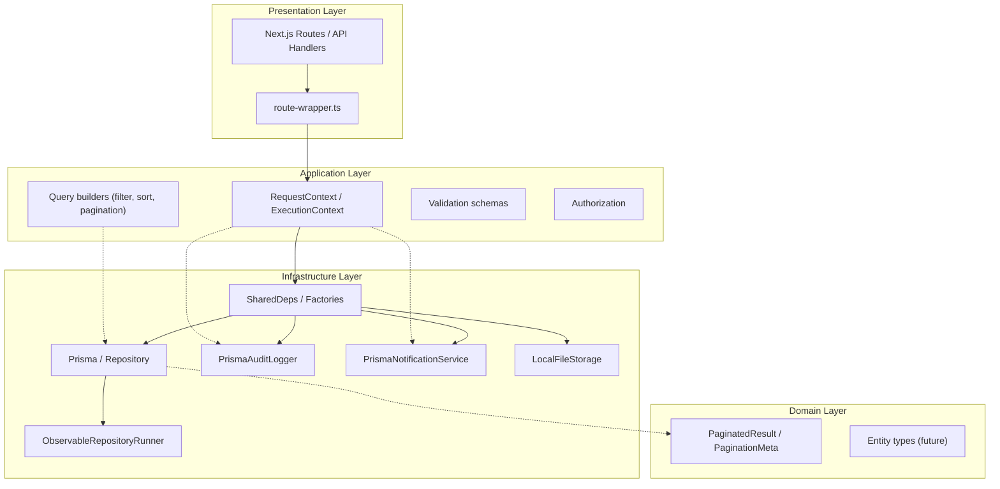

### Why Dependencies Point Inward

| Rule | Rationale |
|------|-----------|
| Infrastructure implements application contracts | Application defines *what* it needs (`ExecutionContext`, `FilterInput`); infrastructure provides *how* (Prisma queries, filesystem I/O). |
| Domain has no infrastructure imports | Business rules and value objects remain testable without a database or filesystem. |
| Application does not import Prisma | Feature services depend on interfaces and factories, not ORM types. |
| Presentation creates context, not repositories | HTTP layer builds `ExecutionContext`; application/infrastructure factories wire dependencies. |

**Verified import directions in Phase 4B:**

- `infrastructure/database/repository/query/*` imports `@/shared/application/query` and `@/shared/domain/pagination`
- `infrastructure/di/shared-deps.ts` imports `@/shared/application/context`
- No file under `src/shared/domain/` imports from `infrastructure/`
- No file under `src/shared/application/` imports Prisma or infrastructure implementations (only types/context)

---

## 4. Shared Dependency Composition

Dependency composition is the central integration point for all shared infrastructure services.

### SharedDatabaseDeps

Defined in `di/shared-database-deps.ts`:

```typescript
export interface SharedDatabaseDeps {
  readonly prisma: PrismaClient;
  readonly transactionManager: ITransactionManager;
}
```

Created by `createSharedDatabaseDeps(prismaClient?)`. Defaults to the module-level `prisma` singleton. Wraps `PrismaTransactionManager`, which delegates to `prisma.$transaction()`.

### SharedDeps

Defined in `di/shared-deps.ts`:

```typescript
export interface SharedDeps {
  readonly logger: ILogger;
  readonly prisma: PrismaClient;
  readonly transactionManager: ITransactionManager;
  readonly auditLogger: IAuditLogger;
  readonly notificationService: INotificationService;
  readonly fileStorage: IFileStorage;
}
```

`SharedDeps` is the **aggregate root** for request-scoped and transaction-scoped infrastructure access.

### Factory Functions

#### `createSharedDeps(options?)`

Creates a full `SharedDeps` instance from optional:

| Option | Effect |
|--------|--------|
| `logger` | Uses provided logger; defaults to console logger at `appConfig.logging.level` |
| `tx` | Binds audit logger and notification service to the transaction client |
| `auditContext` | Sets default audit metadata on `PrismaAuditLogger` |

Internally composes:

1. `createSharedDatabaseDeps()`
2. `createSharedAuditDeps(databaseDeps, { logger, auditContext, tx })`
3. `createSharedNotificationDeps(databaseDeps, { logger, tx })`
4. `createSharedStorageDeps({ logger })`

#### `createSharedDepsFromRequestContext(request, logger, options?)`

Convenience wrapper that derives `auditContext` from `RequestContext` via `createAuditContextFromRequest(request)` unless explicitly overridden.

#### `createSharedDepsFromExecutionContext(ctx)`

Builds `SharedDeps` from an `ExecutionContext`:

- Uses `ctx.logger` directly
- Creates audit logger via `createAuditLoggerFromExecutionContext` (includes request metadata + `ctx.tx`)
- Creates notification service via `createNotificationServiceFromExecutionContext` (respects `ctx.tx`)
- Creates file storage via `createFileStorageFromExecutionContext`

This is the **primary factory for HTTP request handlers**.

#### `createTransactionScopedSharedDeps(base, tx)`

Creates a new `SharedDeps` where audit and notification services are bound to `tx`. Used when entering a transaction boundary.

#### `runWithTransactionScopedSharedDeps(deps, operation, auditContext?)`

The **central transaction primitive**:

```typescript
return deps.transactionManager.run(async (tx) => {
  const transactionDeps = createTransactionScopedSharedDeps(
    { logger: deps.logger, auditContext },
    tx,
  );
  return operation(transactionDeps, tx);
});
```

#### `runWithSharedTransaction(deps, operation, auditContext?)`

Simplified wrapper that passes only `transactionDeps` to the operation callback (no explicit `tx` parameter).

### Composition Root

`di/container.ts` is documented as the composition root:

> Feature modules should import factories from here rather than individual DI files.

`di/index.ts` re-exports everything from `container.ts` to avoid duplicate export lists.

Top-level `infrastructure/index.ts` re-exports:

- `di/container`
- `database`
- `audit`
- `notifications`
- `storage`
- `request`

### Lifecycle Diagram

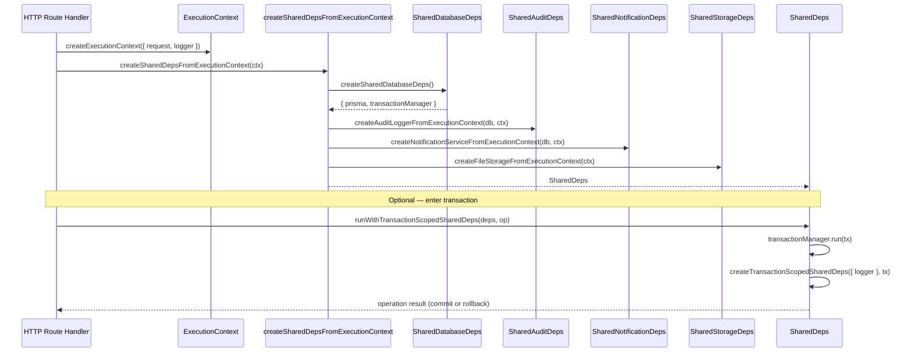

---

## 5. Database Infrastructure

### Prisma Client

**File:** `database/prisma-client.ts`

- Uses `@prisma/adapter-pg` with connection string from `getDatabaseUrl()`
- Singleton pattern via `globalThis` to survive Next.js hot reload in development
- Exported `prisma` is a **Proxy** that lazily resolves to `getPrismaClient()`

```typescript
export function createPrismaClient(): PrismaClient {
  const adapter = new PrismaPg({ connectionString: getDatabaseUrl() });
  return new PrismaClient({ adapter });
}
```

### Type Aliases

**File:** `database/prisma-types.ts`

| Type | Definition |
|------|------------|
| `PrismaClient` | Re-exported from generated client |
| `TransactionClient` | `Prisma.TransactionClient` |
| `DbClient` | `PrismaClient \| TransactionClient` |

### Transaction-Aware Database Access

**File:** `database/repository-base.ts`

```typescript
export function resolveDbClient(tx?: Prisma.TransactionClient): DbClient {
  return tx ?? prisma;
}

export function resolveDbClientFromContext(
  ctx: Pick<ExecutionContext, "tx">,
): DbClient {
  return resolveDbClient(ctx.tx);
}
```

All infrastructure services that write to the database (`PrismaAuditLogger`, `PrismaNotificationService`, repositories) accept an optional `tx` and resolve the active client through `resolveDbClient`.

### Error Mapping

**File:** `database/prisma-error-mapper.ts`

`mapPrismaError(error)` translates Prisma errors to application errors:

| Prisma Code | Application Error |
|-------------|-------------------|
| P2002 (unique constraint) | `ConflictError` |
| P2025 (record not found) | `NotFoundError` |
| P2003 (foreign key) | `UnprocessableError` |
| P2014 (relation violation) | `UnprocessableError` |
| Other Prisma client errors | `InternalError` with `DATABASE_ERROR` code |
| Already an `AppError` | Passed through unchanged |

`withPrismaError(operation)` wraps any async operation, catching and re-throwing mapped errors.

### Transaction Manager

**File:** `database/transaction-manager.ts`

```typescript
export interface ITransactionManager {
  run<T>(operation: (tx: Prisma.TransactionClient) => Promise<T>): Promise<T>;
}

export class PrismaTransactionManager implements ITransactionManager {
  run<T>(operation) {
    return this.prisma.$transaction(operation);
  }
}
```

### Repository Base (Low-Level)

**File:** `database/repository-base.ts`

This is distinct from `database/repository/prisma-repository-base.ts`. The low-level module provides:

- `resolveDbClient` / `resolveDbClientFromContext`
- `withPrismaError`

It is imported directly by audit, notification, and observability code that needs error mapping without the full repository runner.

### Database Access Sequence

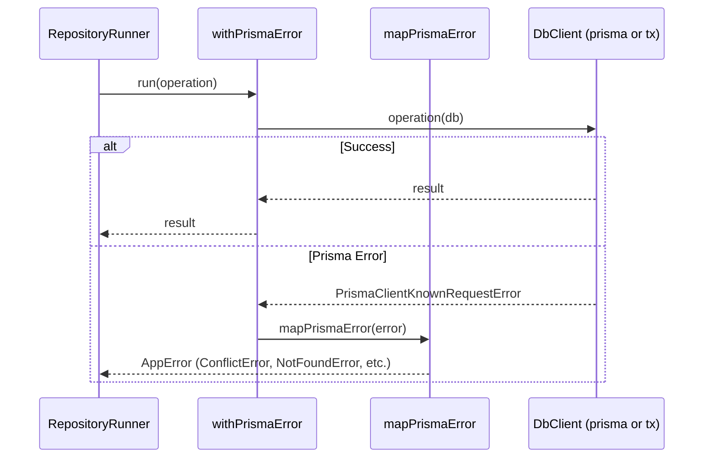

---

## 6. Repository Foundation

The repository foundation provides two complementary patterns: **composition** via `RepositoryRunner` and **inheritance** via `PrismaRepositoryBase`.

### RepositoryRunner (Composition)

**File:** `database/repository/repository-runner.ts`

```typescript
export interface RepositoryRunner {
  readonly db: DbClient;
  run<T>(operation: (db: DbClient) => Promise<T>, meta?: RepositoryOperationMeta): Promise<T>;
  withTransaction(tx: Prisma.TransactionClient): RepositoryRunner;
}
```

`createRepositoryRunner(options)` where `options: RepositoryBaseOptions`:

| Field | Purpose |
|-------|---------|
| `prisma` | Root PrismaClient (used when no tx) |
| `logger` | Optional logger for operation success/failure |
| `tx` | Optional transaction client override |

Behavior:

1. Resolves `db` via `resolveDbClient(options.tx)`
2. Wraps operations in `withPrismaError`
3. Logs debug on success, error on failure (with optional `RepositoryOperationMeta`)
4. `withTransaction(tx)` returns a new runner bound to the transaction

### PrismaRepositoryBase (Inheritance)

**File:** `database/repository/prisma-repository-base.ts`

```typescript
export class PrismaRepositoryBase {
  protected get db(): DbClient;
  protected get logger();
  protected run<T>(operation, meta?): Promise<T>;
  withTransaction(tx): PrismaRepositoryBase;
}
```

Internally delegates to a `RepositoryRunner` instance. Feature repositories can extend this class and call `this.run()` for protected access to db, logging, and error mapping.

### CRUD Helpers

**File:** `database/repository/repository-operations.ts`

Standalone functions that accept a `RepositoryRunner`:

| Function | Default `operation` meta |
|----------|-------------------------|
| `repositoryFindFirst` | `"findFirst"` |
| `repositoryFindMany` | `"findMany"` |
| `repositoryCreate` | `"create"` |
| `repositoryUpdate` | `"update"` |
| `repositoryDelete` | `"delete"` |
| `repositoryCount` | `"count"` |

Each delegates to `runner.run(query, { operation, ...meta })`.

### Factory Functions

**File:** `database/repository/create-repository-base.ts`

| Factory | Creates from |
|---------|-------------|
| `createRepositoryRunner(options)` | Raw options |
| `createRepositoryBase(options)` | Raw options → `PrismaRepositoryBase` |
| `createRepositoryRunnerFromSharedDeps(deps, tx?)` | `SharedDeps` |
| `createRepositoryBaseFromSharedDeps(deps, tx?)` | `SharedDeps` |
| `createRepositoryRunnerFromExecutionContext(deps, ctx)` | `ExecutionContext` |
| `createRepositoryBaseFromExecutionContext(deps, ctx)` | `ExecutionContext` |
| `createRepositoryBaseFromFullExecutionContext(ctx, prisma)` | Full context shortcut |

### Composition vs Inheritance

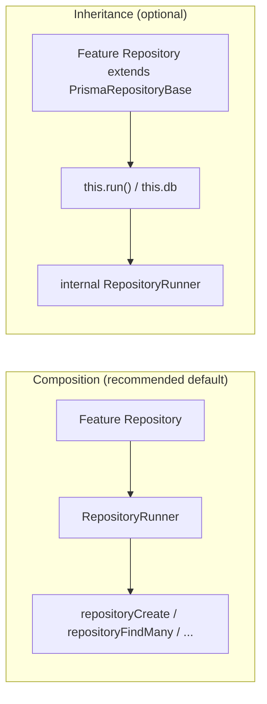

### Recommended Pattern for Future Repositories

1. **Define a feature repository interface** in the application layer (Phase 5).
2. **Implement using composition** with `RepositoryRunner`:
   - Obtain runner via `createRepositoryRunnerFromSharedDeps(deps, tx)` or from `RepositoryUnitOfWorkContext.runner`.
   - Use `repositoryFindMany`, `repositoryCreate`, etc., or call `runner.run()` directly for custom queries.
3. **Optionally wrap with observability** via `createObservableRepositoryRunnerFromSharedDeps` or `wrapRepositoryRunnerWithObservability`.
4. **Prefer factories over direct instantiation** — pass `SharedDeps` or `RepositoryUnitOfWorkContext`, not raw `PrismaClient`.
5. **Use inheritance only when** a base class genuinely reduces boilerplate across many methods on the same entity.

Example shape (illustrative — no feature repository exists yet):

```typescript
export function createExampleRepository(deps: SharedDeps, tx?: TransactionClient) {
  const runner = createObservableRepositoryRunnerFromSharedDeps(deps, {
    tx,
    repositoryName: "ExampleRepository",
  });

  return {
    findById(id: string) {
      return repositoryFindFirst(runner, (db) =>
        db.example.findUnique({ where: { id } }),
        { model: "Example" },
      );
    },
  };
}
```

---

## 7. Query Infrastructure

Query infrastructure bridges **application-layer query inputs** to **Prisma query arguments** and executes paginated reads.

### RepositoryQuerySpec

**File:** `database/repository/query/query-specification.ts`

```typescript
export interface RepositoryQuerySpec {
  pagination: PaginationInput;   // from @/shared/application/query
  sort?: SortInput;
  filter?: FilterInput;
  search?: SearchInput;
}
```

`createRepositoryQuerySpec(input)` normalizes raw handler input (page, pageSize, sortBy, sortOrder, filter, search term, searchFields) into a spec. Search is omitted when the term is empty after trimming.

### Filtering, Sorting, Pagination

**File:** `database/repository/query/compose-prisma-query.ts`

`composePrismaQuery(options)` orchestrates:

1. `buildPagination(spec.pagination)` → `{ skip, take, page, pageSize }`
2. `buildFilter(spec.filter)` → generic filter object
3. `buildSort(spec.sort)` → sort object
4. `mapFilter(filter)` → entity-specific Prisma `where` clause (provided by caller)
5. `buildSearchWhereFromInput(spec.search, searchFields)` → OR-based `contains` clauses
6. `mergePrismaWhere(baseWhere, filterWhere, searchWhere)` → combined `where`

Returns `ComposedPrismaQuery<TWhere, TOrderBy>` with `where`, `orderBy`, `skip`, `take`, `page`, `pageSize`.

### Searching

**File:** `database/repository/query/build-search.ts`

- `normalizeSearchTerm` — trims and rejects empty strings
- `resolveSearchSpec` — requires both term and fields
- `buildPrismaSearchWhere` — produces `{ OR: [{ field: { contains, mode: "insensitive" } }, ...] }`
- `buildSearchWhereFromInput` — convenience combining resolve + build

Search fields are **per-repository** — the caller provides `searchFields` or `mapFilter` when composing queries.

### Pagination & Count Queries

**File:** `database/repository/query/execute-paged-query.ts`

`executePagedQuery` runs **parallel** `findMany` and `count` inside a single `runner.run()`:

```typescript
const [items, total] = await Promise.all([
  handlers.findMany(db, args),
  handlers.count(db, { where: query.where }),
]);
return {
  items,
  meta: buildPaginationMeta(query.page, query.pageSize, total),
};
```

`runRepositoryPagedQuery` combines `composePrismaQuery` + `executePagedQuery` in one call.

### PaginatedResult

**Domain type:** `src/shared/domain/pagination.ts`

```typescript
export interface PaginationMeta {
  page: number;
  pageSize: number;
  total: number;
  totalPages: number;
}

export interface PaginatedResult<T> {
  items: T[];
  meta: PaginationMeta;
}
```

`buildPaginationMeta` calculates `totalPages` as `Math.ceil(total / pageSize)` (0 when pageSize is 0).

### Query Request Flow

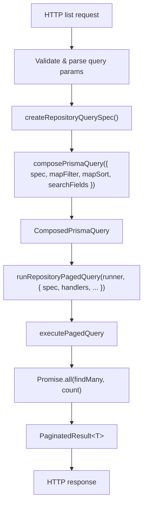

### Where Clause Merging

**File:** `database/repository/query/merge-prisma-where.ts`

- 0 clauses → `undefined`
- 1 clause → returned as-is
- 2+ clauses → `{ AND: [clause1, clause2, ...] }`

This allows base scoping (e.g., tenant filter), user filters, and search to compose safely.

---

## 8. Unit of Work

The Unit of Work pattern coordinates **multiple repositories** within a **single Prisma transaction**, sharing one `TransactionClient` and one transaction-scoped `SharedDeps`.

### Core Types

**File:** `database/repository/unit-of-work/unit-of-work-types.ts`

```typescript
export interface RepositoryUnitOfWorkContext {
  readonly tx: Prisma.TransactionClient;
  readonly deps: SharedDeps;
  readonly runner: RepositoryRunner;
  readonly repositoryBase: PrismaRepositoryBase;
  createRunner(): RepositoryRunner;
  createRepositoryBase(): PrismaRepositoryBase;
}

export interface IUnitOfWork {
  run<T>(operation: (context: RepositoryUnitOfWorkContext) => Promise<T>): Promise<T>;
}
```

Factory types:

- `UnitOfWorkRepositoryFactory<TRepositories>` — `(context) => TRepositories`
- `UnitOfWorkOperation<TRepositories, TResult>` — `(repositories, context) => Promise<TResult>`

### RepositoryUnitOfWork

**File:** `database/repository/unit-of-work/repository-unit-of-work.ts`

Thin class wrapping `runWithRepositoryUnitOfWork(deps, operation)`.

### Context Creation

**File:** `database/repository/unit-of-work/create-repository-unit-of-work-context.ts`

| Function | Behavior |
|----------|----------|
| `createRepositoryUnitOfWorkContext(deps, tx)` | Creates runner + repositoryBase bound to `tx`; stores `deps` as-is |
| `createRepositoryUnitOfWorkContextForTransaction(deps, tx, auditContext?)` | First calls `createTransactionScopedSharedDeps`, then creates context |

### Transaction Entry Points

**File:** `database/repository/unit-of-work/run-with-repository-unit-of-work.ts`

```typescript
export async function runWithRepositoryUnitOfWork(deps, operation, auditContext?) {
  return runWithTransactionScopedSharedDeps(
    deps,
    (transactionDeps, tx) =>
      operation(createRepositoryUnitOfWorkContext(transactionDeps, tx)),
    auditContext,
  );
}
```

**File:** `database/repository/unit-of-work/run-with-unit-of-work-repositories.ts`

| Function | Purpose |
|----------|---------|
| `runWithRepositoryUnitOfWorkFromExecutionContext` | If `ctx.tx` exists, reuses it; otherwise starts new transaction |
| `runWithUnitOfWorkRepositories` | Combines repository factory + operation |
| `runWithUnitOfWorkRepositoriesFromExecutionContext` | Same, from execution context |

### Shared Transaction Client

All repositories created within a UoW context receive the **same** `tx`:

- `context.runner` — bound to `tx`
- `context.createRunner()` — creates additional runners with same `tx`
- `context.deps.auditLogger` — transaction-scoped when created via `createTransactionScopedSharedDeps`
- `context.deps.notificationService` — transaction-scoped similarly

### Unit of Work Sequence

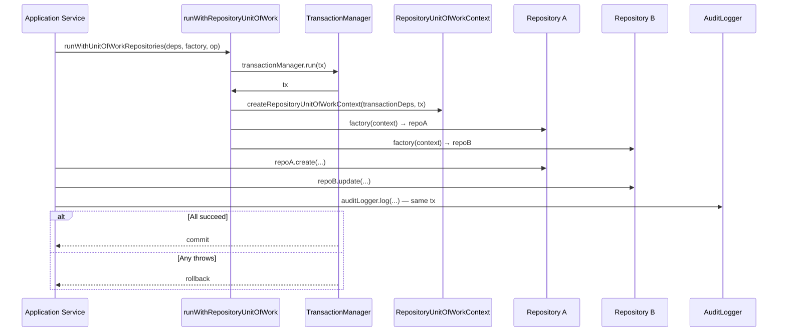

### Nested Transaction Behavior

When `ExecutionContext.tx` is already set (handler already inside a transaction):

```typescript
if (ctx.tx) {
  const deps = createSharedDepsFromExecutionContext(ctx);
  return operation(createRepositoryUnitOfWorkContext(deps, ctx.tx));
}
```

No new transaction is started — the existing `tx` is reused. Audit and notification services from execution context already respect `ctx.tx`.

---

## 9. Audit Infrastructure

### Contracts

**File:** `audit/audit-logger.interface.ts`

| Export | Purpose |
|--------|---------|
| `AUDIT_ACTIONS` | Canonical action enum (CREATE, UPDATE, DELETE, LOGIN, etc.) |
| `AUDIT_STATUSES` | SUCCESS, FAILED, WARNING |
| `AuditContext` | Default metadata: userId, module, ipAddress, userAgent, requestId, httpMethod, route |
| `AuditEntry` | Successful or status-bearing log entry |
| `AuditFailureEntry` | Failure entry with `error` object |
| `IAuditLogger` | `log(entry)` and `logFailure(entry)` |

### PrismaAuditLogger

**File:** `audit/prisma-audit-logger.ts`

- Accepts `prisma`, optional `logger`, `defaultContext`, and `tx`
- `log()` / `logFailure()` map entries and persist to `auditLog` table
- Uses `resolveDbClient(this.tx)` and `withPrismaError`
- `withTransaction(tx)` returns new instance bound to transaction
- `withContext(context)` merges additional default context

### Audit Mapping

**File:** `audit/audit-entry.mapper.ts`

- `mapAuditEntryToCreateInput(entry, context)` → `Prisma.AuditLogUncheckedCreateInput`
- `mapAuditFailureEntryToCreateInput(entry, context)` → sets status to `FAILED`, extracts error message via `extractAuditErrorMessage`
- Merges entry-level and context-level metadata (ipAddress, userAgent, requestId, httpMethod, route)

### Request Metadata

**File:** `audit/audit-request-context.ts`

```typescript
export function createAuditContextFromRequest(
  request: RequestContext,
  override?: Partial<AuditContext>,
): AuditContext
```

Maps `userId`, `ipAddress`, `userAgent`, `requestId`, `httpMethod`, `route` from `RequestContext`.

Used by:

- `createSharedDepsFromRequestContext` (default audit context)
- `createAuditLoggerFromExecutionContext` (execution-scoped logger)

### Transaction Support

When `SharedDeps` is created with `tx` or via `createTransactionScopedSharedDeps`, the audit logger writes to the **same transaction**. Audit records commit or rollback with the business operation.

### Audit Write Flow

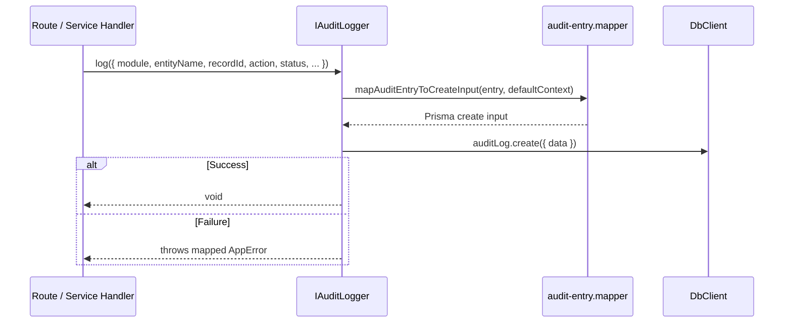

---

## 10. Notification Infrastructure

### Notification Service

**File:** `notifications/notification-service.interface.ts`

```typescript
export interface INotificationService {
  enqueue(payload: NotificationPayload): Promise<NotificationResult>;
  cancel(notificationId: string): Promise<void>;
}
```

**Implementation:** `PrismaNotificationService` in `prisma-notification-service.ts`

### Notification Payload

**File:** `notifications/notification-types.ts`

```typescript
export interface NotificationPayload {
  eventKey: string;
  module: string;
  entityName: string;
  recordId: string;
  recipients: RecipientInput[];
  priority?: NotificationPriority;  // LOW | NORMAL | HIGH | URGENT
  scheduledAt?: Date;
  data?: Record<string, unknown>;
}
```

### Template Resolution

**File:** `notifications/notification-template-resolver.ts`

`resolveNotificationTemplate(db, eventKey)`:

1. Loads `NotificationTemplate` by `eventKey`
2. Throws `NotFoundError` if missing
3. Throws `UnprocessableError` if template is disabled
4. Returns `{ id, channel, subject, title, body }`

Template determines **channel** and message content; the payload supplies entity context and recipients.

### Notification Persistence

**File:** `notifications/notification-payload.mapper.ts`

`mapNotificationPayloadToCreateInput(payload, template)` creates:

- `Notification` record with status `PENDING`, priority from payload (default `NORMAL`)
- Nested `recipients.create` for each `RecipientInput`

Validation:

- At least one recipient required
- Each recipient must have a non-empty `name`

Recipient fields persisted: `userId`, `recipientName`, `recipientEmail`, `recipientPhone`, `recipientWhatsApp`.

### Enqueue Flow

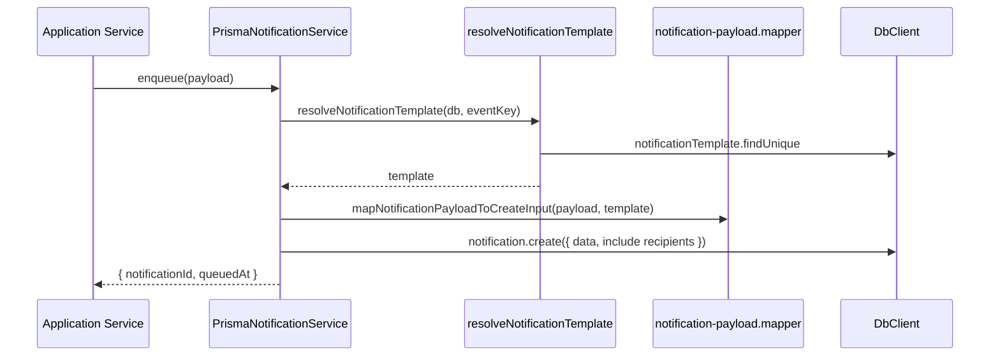

### Cancel

Sets notification status to `CANCELLED` via `notification.update`.

### Transaction Behavior

- Optional `tx` on `PrismaNotificationService` — uses `resolveDbClient(this.tx)`
- When created through `createTransactionScopedSharedDeps`, notifications enqueue within the active transaction
- `withTransaction(tx)` returns transaction-bound instance

### Request Context Helper

**File:** `notifications/notification-request-context.ts`

`createNotificationLogContext(request)` delegates to shared `createRequestLogContext` for structured logging correlation.

### Future Channel Adapters

`notifications/channels/.gitkeep` is a placeholder. Current implementation persists notifications only; delivery adapters are not implemented in Phase 4B.

---

## 11. File Storage Infrastructure

### IFileStorage Contract

**File:** `storage/file-storage.interface.ts`

```typescript
export interface IFileStorage {
  upload(input: UploadInput): Promise<StoredFile>;
  delete(key: string): Promise<DeleteResult>;
  getSignedUrl(key: string, expiresInSeconds: number): Promise<SignedUrlResult>;
}
```

### Provider Factory

**File:** `storage/create-file-storage.ts`

Reads `appConfig.uploads.storage`:

| Provider | Behavior |
|----------|----------|
| `"local"` | Returns `LocalFileStorage` with `basePath` and `publicBaseUrl` from config |
| `"s3"` | Throws `UnprocessableError` — not implemented |
| Other | Throws `InternalError` |

### LocalFileStorage

**File:** `storage/adapters/local-file-storage.ts`

**Upload:**

1. `validateUploadInput(input)` — key, buffer, size, mimeType checks
2. `normalizeStorageKey(input.key)`
3. `resolveStorageFilePath(basePath, key)` — path traversal protection
4. `fs.mkdir` + `fs.writeFile`
5. Returns `{ key, url, mimeType, size }` where `url = buildPublicFileUrl(publicBaseUrl, key)`

**Delete:**

- Normalizes key, resolves path, `fs.unlink`

**getSignedUrl:**

- Throws `UnprocessableError` — not supported for local provider

### Key Normalization

**File:** `storage/storage-key.ts`

- Trims whitespace, strips leading slashes, normalizes backslashes
- Rejects empty keys and keys containing `..`
- `validateUploadInput` ensures buffer length matches declared size

### Path Resolution

**File:** `storage/storage-path.ts`

- `resolveStorageBasePath` — absolute base directory
- `resolveStorageFilePath` — joins base + key, validates result stays within base (prevents directory traversal)
- `buildPublicFileUrl` — `{publicBaseUrl}/uploads/{encoded-key-segments}`

### Configuration

Storage reads from `appConfig`:

- `appConfig.uploads.storage` — provider name
- `appConfig.uploads.path` — local base path
- `appConfig.url` — public base URL for generated file URLs

### Request Context Helper

**File:** `storage/storage-request-context.ts`

`createStorageLogContext(request)` delegates to `createRequestLogContext`.

### Extension Points

| Extension | How |
|-----------|-----|
| S3 / cloud storage | Implement `IFileStorage`, add case in `createFileStorage` |
| Signed URLs | Implement in provider adapter (local explicitly rejects) |
| Additional adapters | Add under `storage/adapters/` |
| Custom validation | Extend `validateUploadInput` or wrap `IFileStorage` |

The `storage/adapters/.gitkeep` and factory stub for `"s3"` indicate intended extension without implementing it.

---

## 12. Repository Observability

Observability wraps `RepositoryRunner` to add **timing**, **structured logging**, and an optional **metrics hook** without double-wrapping Prisma error handling.

### ObservableRepositoryRunner

**File:** `database/repository/observability/observable-repository-runner.ts`

`createObservableRepositoryRunner(options)`:

| Option | Purpose |
|--------|--------|
| `runner` | Inner `RepositoryRunner` to wrap |
| `logger` | Logs start, completion, failure |
| `metrics` | `IRepositoryMetrics` recorder (defaults to `noopRepositoryMetrics`) |
| `observationContext` | Request correlation fields |
| `repositoryName` | Identifies repository in logs/metrics |

**Important:** The observable runner calls `withPrismaError` directly on the inner runner's `db`, **not** `innerRunner.run()`. This avoids duplicate logging from the inner runner's success/failure handlers.

Behavior per operation:

1. Record `startedAt = performance.now()`
2. Build observation meta via `buildRepositoryObservationMeta`
3. Log debug "started"
4. Execute operation with `withPrismaError`
5. On success: log debug "completed" with `durationMs`, call `metrics.recordObservation`
6. On failure: log error with `durationMs`, record failed observation, re-throw

`withTransaction(tx)` wraps inner runner and sets `inTransaction: true` on observation context.

### IRepositoryMetrics

**File:** `database/repository/observability/repository-metrics.interface.ts`

```typescript
export interface RepositoryMetricsObservation {
  operation: string;
  durationMs: number;
  success: boolean;
  model?: string;
  repositoryName?: string;
  requestId?: string;
  userId?: string;
  route?: string;
  inTransaction?: boolean;
}

export interface IRepositoryMetrics {
  recordObservation(observation: RepositoryMetricsObservation): void;
}
```

Default: `noopRepositoryMetrics` (empty implementation).

### Request Correlation

**File:** `database/repository/observability/repository-observation-context.ts`

```typescript
export interface RepositoryObservationContext {
  requestId?: string;
  userId?: string;
  route?: string;
  httpMethod?: string;
  inTransaction?: boolean;
}
```

- `createRepositoryObservationContextFromRequest(request)`
- `createRepositoryObservationContextFromExecutionContext(ctx)` — sets `inTransaction: ctx.tx !== undefined`

Uses shared `createRequestLogContext` from `infrastructure/request`.

### Factory Functions

**File:** `database/repository/observability/create-observable-repository-runner.ts`

| Factory | Source |
|---------|--------|
| `createObservableRepositoryRunnerFromSharedDeps(deps, options?)` | SharedDeps + optional tx, metrics, context |
| `createObservableRepositoryRunnerFromExecutionContext(deps, ctx, options?)` | Auto-builds observation context from execution context |
| `wrapRepositoryRunnerWithObservability(runner, options)` | Wraps existing runner |

### Execution Flow

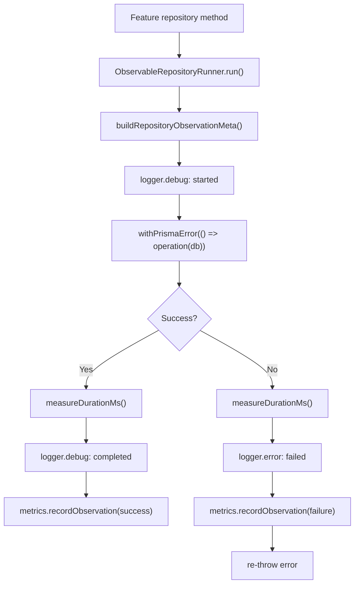

---

## 13. Request Lifecycle

The following diagram shows how an HTTP request flows through context creation, dependency wiring, and infrastructure services.

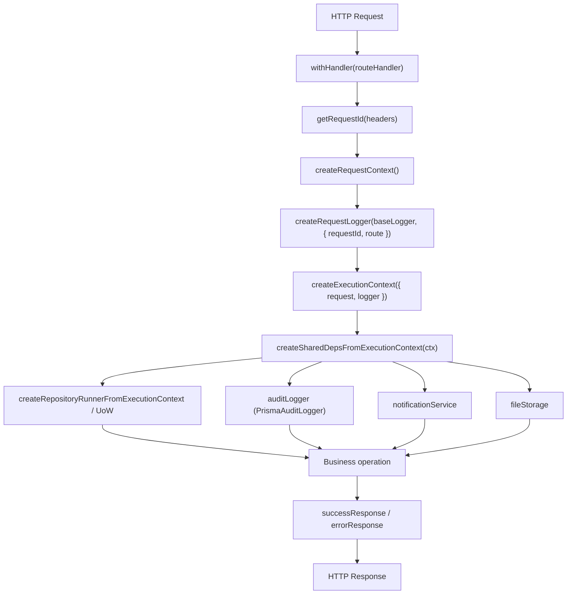

### Context Types

**RequestContext** (`application/context/request-context.ts`):

- `requestId`, `userId`, `role`, `ipAddress`, `userAgent`, `route`, `httpMethod`, `timestamp`

**ExecutionContext** (`application/context/execution-context.ts`):

- `request`, `logger`, optional `tx`, `audit`, `permissions`

The HTTP `withHandler` wrapper creates `ExecutionContext` without `tx`. Transaction boundaries are introduced by application services calling `runWithRepositoryUnitOfWork` or `runWithSharedTransaction`.

### Route Wrapper Error Handling

**File:** `http/route-wrapper.ts`

- Catches all errors, normalizes via `normalizeError`, serializes via `serializeAppError`
- Returns appropriate HTTP status from `AppError.httpStatus`
- Includes `requestId` in all responses

---

## 14. Transaction Lifecycle

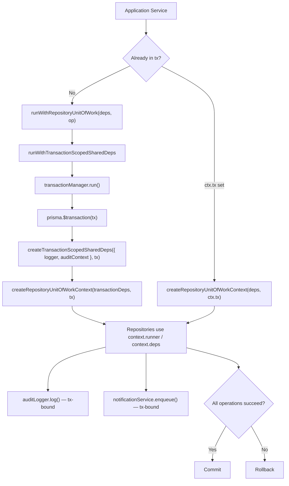

### Transaction Propagation Rules

| Scenario | Behavior |
|----------|----------|
| New request, no tx | `runWithRepositoryUnitOfWork` starts `$transaction` |
| `ExecutionContext.tx` already set | Reuses existing tx; no nested `$transaction` |
| Audit/notification in transaction | Created with `tx` option; writes participate in same commit |
| File storage in transaction | **Not transaction-aware** — filesystem operations are outside DB transaction |
| Error in any repository operation | Entire transaction rolls back |

### Alternative Entry: runWithSharedTransaction

For operations that need transaction-scoped `SharedDeps` but not the full UoW context:

```typescript
await runWithSharedTransaction(deps, async (transactionDeps) => {
  await transactionDeps.auditLogger.log({ ... });
  // custom logic with transactionDeps.notificationService, etc.
});
```

---

## 15. Extension Guidelines

### Adding a Repository (Phase 5+)

1. Define the repository **interface** in the feature's application layer.
2. Implement in the feature's infrastructure layer using:
   - `createRepositoryRunnerFromSharedDeps(deps, tx)` or UoW context
   - `repositoryFindMany`, `repositoryCreate`, etc., or custom `runner.run()` calls
   - `composePrismaQuery` / `runRepositoryPagedQuery` for list endpoints
3. Wrap with `createObservableRepositoryRunnerFromSharedDeps` for logging/metrics.
4. Accept `SharedDeps` or `RepositoryUnitOfWorkContext` — never instantiate `PrismaClient` directly.
5. Do **not** import Prisma types into application or domain layers.

### Adding Infrastructure

1. Define the **contract** in Phase 4A style (interface + types under `shared/infrastructure/{domain}/`).
2. Implement the Prisma/filesystem adapter in the same folder.
3. Add a `shared-{domain}-deps.ts` factory in `di/`.
4. Wire into `SharedDeps` in `shared-deps.ts`.
5. Export from `di/container.ts` and relevant barrel `index.ts` files.
6. Verify no inward dependency violations (infrastructure must not depend on feature modules).

### Adding Shared Services

Follow the audit/notification pattern:

- Interface defining the service contract
- Implementation class with optional `tx`, `logger`
- `resolveDbClient(tx)` for database access
- `withPrismaError` for error mapping
- Factory in `di/shared-{service}-deps.ts`
- `create{Service}FromExecutionContext` for request-scoped wiring

### Adding Observability

- Implement `IRepositoryMetrics` and pass to `createObservableRepositoryRunnerFromSharedDeps`
- Or use `wrapRepositoryRunnerWithObservability` on an existing runner
- Provide `repositoryName` and ensure `ExecutionContext` carries request metadata

### Adding Transaction Support

- Accept optional `tx` in repository factories
- Use UoW for multi-repository operations
- Use `createTransactionScopedSharedDeps` when services need tx-bound audit/notification
- Never call `$transaction` directly from feature code — use `ITransactionManager` via `SharedDeps`

### Clean Architecture Checklist

- [ ] Application layer depends on interfaces, not implementations
- [ ] Domain layer has zero infrastructure imports
- [ ] Infrastructure implements application contracts
- [ ] Presentation creates context; does not access Prisma
- [ ] All database errors pass through `withPrismaError` / `mapPrismaError`

---

## 16. Design Decisions

### Composition Over Inheritance

**Decision:** `RepositoryRunner` is the primary abstraction; `PrismaRepositoryBase` is optional.

**Rationale:** Composition allows feature repositories to be plain functions/objects (easier testing, tree-shaking, and flexibility). Inheritance is available when a class-based repository genuinely simplifies repeated `this.run()` calls.

### Explicit Dependency Injection

**Decision:** No DI container framework. Factory functions compose dependencies explicitly.

**Rationale:** TypeScript-friendly, zero magic, easy to trace. `SharedDeps` and per-domain factories (`createSharedAuditDeps`, etc.) make wiring visible and testable.

### Transaction Propagation

**Decision:** Single primitive `runWithTransactionScopedSharedDeps`; UoW and `runWithSharedTransaction` delegate to it. Existing `ctx.tx` is reused without nesting.

**Rationale:** Prevents accidental nested transactions and ensures audit/notification services share the same `tx` as repositories.

### Repository Isolation

**Decision:** Repositories receive `DbClient` through runners, not global `prisma` import (except low-level singleton for root client).

**Rationale:** Transaction participation requires explicit client resolution. Global imports would break transactional consistency.

### Request-Scoped Dependencies

**Decision:** `createSharedDepsFromExecutionContext` builds services with request-derived audit context and request-scoped logger.

**Rationale:** Audit logs and structured logs must correlate to `requestId`, route, and user without manual threading through every call.

### Infrastructure Isolation

**Decision:** All Phase 4B code lives under `src/shared/infrastructure/`. Feature modules will have their own infrastructure folders.

**Rationale:** Shared concerns are centralized; feature-specific persistence stays in feature boundaries.

### Error Mapping

**Decision:** All Prisma operations go through `withPrismaError` → `mapPrismaError`.

**Rationale:** Consistent HTTP-facing error types (`ConflictError`, `NotFoundError`, etc.) regardless of which repository or service threw.

### Observability by Default

**Decision:** Observable runner wraps inner runner but calls `withPrismaError` directly to avoid double logging.

**Rationale:** Feature repositories get timing and correlation by wrapping once at creation time. Default metrics are no-op until a backend is plugged in.

### Shared Request Log Context (4B-010)

**Decision:** Extract `createRequestLogContext` to `infrastructure/request/` for use by notifications, storage, and observability.

**Rationale:** Eliminates duplicated helpers; single source for `{ requestId, userId, route, httpMethod }` log fields.

### DI Barrel Consolidation (4B-010)

**Decision:** `di/index.ts` re-exports only from `container.ts`.

**Rationale:** Single export list prevents drift between duplicate barrel files.

---

## 17. Phase 4B Summary

| Milestone | Description |
|-----------|-------------|
| **4B-001 — Prisma Infrastructure Foundation** | Prisma client singleton with Pg adapter, `DbClient` types, `resolveDbClient`, `withPrismaError`, `mapPrismaError`, `PrismaTransactionManager`, low-level `repository-base.ts`, and `shared-database-deps.ts`. Backward-compatible re-export via `src/lib/prisma.ts`. |
| **4B-002 — Audit Infrastructure** | `IAuditLogger` contract, `PrismaAuditLogger`, audit entry mapping to `AuditLog` table, request context mapping, error message extraction, and `shared-audit-deps.ts` factory. |
| **4B-003 — Notification Infrastructure** | `INotificationService` contract, `PrismaNotificationService`, template resolution from `NotificationTemplate`, payload/recipient mapping, cancel support, and `shared-notification-deps.ts` factory. |
| **4B-004 — File Storage Infrastructure** | `IFileStorage` contract, `LocalFileStorage` adapter, key normalization, path traversal protection, public URL generation, storage error mapping, provider factory (`local` implemented, `s3` stub), and `shared-storage-deps.ts`. |
| **4B-005 — Shared Dependency Composition** | `SharedDeps` aggregate, `createSharedDeps` family, `createSharedDepsFromExecutionContext`, `createSharedDepsFromRequestContext`, `di/container.ts` composition root, and top-level `infrastructure/index.ts` barrel. |
| **4B-006 — Repository Foundation** | `RepositoryRunner`, `PrismaRepositoryBase`, CRUD helper functions, repository types, and factories from SharedDeps/ExecutionContext. |
| **4B-007 — Query & Pagination Infrastructure** | `RepositoryQuerySpec`, `composePrismaQuery`, search builders, where merging, `executePagedQuery`, `runRepositoryPagedQuery`, and `PaginatedResult` integration with domain types. |
| **4B-008 — Unit of Work & Transaction Integration** | `RepositoryUnitOfWorkContext`, `IUnitOfWork`, `runWithRepositoryUnitOfWork`, multi-repository helpers, transaction-scoped context creation, and `runWithTransactionScopedSharedDeps` primitive. |
| **4B-009 — Repository Observability** | `createObservableRepositoryRunner`, timing via `performance.now()`, structured logging, `IRepositoryMetrics` hook, request correlation context, and factory functions from SharedDeps/ExecutionContext. |
| **4B-010 — Verification & Hardening** | Consolidated `createRequestLogContext`, unified transaction entry via `runWithTransactionScopedSharedDeps`, UoW context helper consolidation, DI barrel deduplication, export verification, typecheck/lint/circular dependency validation. No feature code added. |

---

## Appendix: Key Import Paths

| Need | Import from |
|------|-------------|
| Full shared deps + transaction helpers | `@/shared/infrastructure/di/container` |
| All infrastructure barrels | `@/shared/infrastructure` |
| Repository + query + UoW + observability | `@/shared/infrastructure/database` |
| Prisma client | `@/shared/infrastructure/database/prisma-client` or `@/lib/prisma` |
| Audit logger types | `@/shared/infrastructure/audit` |
| Notification service types | `@/shared/infrastructure/notifications` |
| File storage types | `@/shared/infrastructure/storage` |
| Request log context | `@/shared/infrastructure/request` |
| Paginated result types | `@/shared/domain/pagination` |
| Query input types | `@/shared/application/query` |
| Request/execution context | `@/shared/application/context` |

---

*This document describes the Phase 4B infrastructure as implemented. Feature repositories and business services are intentionally out of scope and will be documented in subsequent phases.*
