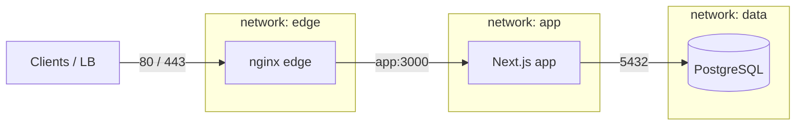

# Reverse Proxy & Networking — Phase 8-005

**Project:** Rental ERP (`rental-erp/`)  
**Proxy:** Nginx 1.27 (Alpine)  
**Compose:** `docker-compose.prod.yml`

This guide covers the production reverse proxy, TLS readiness, networking, and operations. It does **not** deploy to cloud or configure Kubernetes.

---

## Architecture



| Component | Public ports | Networks | Role |
|-----------|--------------|----------|------|
| `nginx` | `80`, `443` | `edge`, `app` | TLS termination, redirects, headers, caching |
| `app` | none (expose 3000) | `app`, `data` | Next.js standalone |
| `db` | none | `data` | PostgreSQL |
| `migrate` | none | `data` | One-off migrations (profile) |

Nginx **cannot** reach PostgreSQL. Only the application connects to the database.

---

## File Layout

| Path | Purpose |
|------|---------|
| `nginx/nginx.conf` | Main config (gzip, upstream, timeouts, `limit_req_zone`) |
| `nginx/conf.d/rental-erp.conf.template` | HTTP→HTTPS + HTTPS proxy (templated `server_name`) |
| `nginx/snippets/proxy-params.conf` | Forwarded headers, buffering, timeouts |
| `nginx/snippets/websocket-params.conf` | Upgrade / WebSocket support |
| `nginx/snippets/ssl-params.conf` | TLS protocols + certificate paths |
| `nginx/snippets/security-headers.conf` | HSTS, CSP baseline, frame options, etc. |
| `nginx/certs/` | Place `fullchain.pem` + `privkey.pem` (not committed) |
| `Dockerfile.nginx` | Proxy image |
| `scripts/nginx-entrypoint.sh` | Template render + `nginx -t` + start |

---

## Routing

| Location | Behavior |
|----------|----------|
| `http://` `/` | `301` → `https://$host$request_uri` |
| `http://` `/.well-known/acme-challenge/` | ACME HTTP-01 (Let's Encrypt) |
| `http://` `/api/health` | Proxied (LB probes before TLS) |
| `http://` `/api/health/ready` | Proxied readiness (DB + migrations) |
| `https://` `/_next/static/` | Proxied + long immutable cache |
| `https://` static extensions | Proxied + 7-day cache |
| `https://` `/api/health` | Proxied + `Cache-Control: no-store` |
| `https://` `/api/health/live` | Liveness alias |
| `https://` `/api/health/ready` | Proxied readiness + `Cache-Control: no-store` |
| `https://` `/api/health/startup` | Startup probe |
| `https://` `/api/metrics` | Prometheus metrics (optional bearer) |
| `https://` `/` (API + pages) | Proxied + no-store; WebSocket-ready |

Upstream: `app:3000` with keepalive pool.

### Rate limiting (Phase 8-009)

| Location | Zone | Rate | Burst |
|----------|------|------|-------|
| `/api/auth/` | `auth_limit` | 5 r/s | 20 |
| `/api/` | `api_limit` | 30 r/s | 60 |

Health and metrics use exact `location =` blocks and are not subject to the `/api/` zone. Exceeded limits return HTTP 429.

---

## HTTPS Setup (placeholders)

1. Obtain certificates (org CA or Let's Encrypt — see below).
2. Copy into `nginx/certs/`:
   - `fullchain.pem`
   - `privkey.pem`
3. Set in `.env.production`:
   - `NGINX_SERVER_NAME=erp.example.com`
   - `APP_URL=https://erp.example.com`
   - `BETTER_AUTH_URL=https://erp.example.com`
4. Start:

```bash
docker compose -f docker-compose.prod.yml --env-file .env.production up --build -d
```

**Do not commit real certificates or private keys.** `*.pem` under `nginx/certs/` is gitignored.

### Let's Encrypt (certbot) — operator guide

Example using a temporary certbot sidecar / host certbot (illustrative):

```bash
# 1) Ensure DNS A/AAAA for NGINX_SERVER_NAME points at this host.
# 2) With Nginx serving :80 and ACME location enabled, request certs:

docker run --rm -it \
  -v "$(pwd)/nginx/certs:/etc/letsencrypt/live/erp.example.com" \
  -v rental-erp-prod_nginx_certbot_www:/var/www/certbot \
  certbot/certbot certonly --webroot \
  -w /var/www/certbot \
  -d erp.example.com \
  --email ops@example.com --agree-tos

# 3) Copy/symlink issued fullchain.pem + privkey.pem into nginx/certs/
# 4) Reload Nginx: docker compose -f docker-compose.prod.yml exec nginx nginx -s reload
```

For production, prefer certbot renew timers / orchestration hooks. This phase only prepares Nginx ACME paths and TLS config.

Organization certificates: install the provided full chain and key as `fullchain.pem` / `privkey.pem`.

---

## Security Headers

Applied by Nginx on HTTPS responses (and re-applied on cached static locations):

- `Strict-Transport-Security`
- `X-Content-Type-Options: nosniff`
- `X-Frame-Options: DENY`
- `Referrer-Policy: strict-origin-when-cross-origin`
- `Permissions-Policy`
- `Content-Security-Policy` (baseline — allows `'unsafe-inline'` / `'unsafe-eval'` for Next.js; refine later)

When Nginx is the edge, set in `.env.production`:

```env
ENABLE_SECURITY_HEADERS=false
ENABLE_HSTS=false
```

so Next.js does not duplicate headers (`next.config.ts` headers remain available for non-proxy deployments).

---

## Compression

- **Gzip** enabled (level 5) for common text/JS/CSS/JSON/SVG/font types.
- **Brotli** is optional; the stock `nginx:alpine` image does not include the Brotli module. Use a custom Nginx build or `nginx-module-brotli` if required.

---

## Port Usage & Firewall

| Port | Direction | Service | Recommendation |
|------|-----------|---------|----------------|
| 80 | Inbound | Nginx HTTP (redirect + ACME + health) | Allow from internet / LB |
| 443 | Inbound | Nginx HTTPS | Allow from internet / LB |
| 3000 | Internal | App | Do **not** publish |
| 5432 | Internal | Postgres | Do **not** publish |

Host firewall (example):

```bash
# Allow SSH + HTTP/HTTPS only
ufw allow OpenSSH
ufw allow 80/tcp
ufw allow 443/tcp
ufw enable
```

---

## Health Checks

| Probe | Target |
|-------|--------|
| App container | `http://127.0.0.1:3000/api/health` (liveness) / `/api/health/ready` (readiness) / `/api/health/startup` / `/api/metrics` |
| Nginx container | `http://127.0.0.1/api/health` (HTTP, no TLS required for local probe) |
| External LB | `https://<host>/api/health` or `http://<host>/api/health`; use `/api/health/ready` before routing traffic after migrate/restore |

Response body: `{ "status": "ok", "service": "rental-erp", ... }` from the existing app route.

---

## Local Validation

### Compose

```bash
docker compose -f docker-compose.prod.yml --env-file .env.production config
```

### Nginx syntax (requires cert files present)

```bash
# After placing PEMs in nginx/certs/
docker build -f Dockerfile.nginx -t rental-erp-nginx:local .
docker run --rm \
  -e NGINX_SERVER_NAME=erp.example.com \
  -v "$(pwd)/nginx/certs:/etc/nginx/certs:ro" \
  rental-erp-nginx:local
# Entrypoint runs `nginx -t` before start.
```

If Docker Desktop is unavailable, review configs under `nginx/` and validate Compose with `docker compose ... config`.

---

## Troubleshooting

| Symptom | Cause | Fix |
|---------|-------|-----|
| Nginx exits immediately | Missing `fullchain.pem` / `privkey.pem` | Install certs per `nginx/certs/README.md` |
| `nginx -t` fails | Bad template / SSL path | Check entrypoint logs; ensure PEMs are readable |
| Redirect loop | App generating `http://` URLs | Set `APP_URL`/`BETTER_AUTH_URL` to `https://` |
| 502 Bad Gateway | App not healthy | `docker compose logs app`; wait for healthcheck |
| Upload 413 | Body too large | Raise `client_max_body_size` in `nginx.conf` to match `UPLOAD_MAX_FILE_SIZE_MB` |
| Duplicate security headers | App + Nginx both emit | Set `ENABLE_SECURITY_HEADERS=false` on app |
| WebSocket failures | Missing Upgrade headers | Confirm `websocket-params.conf` is included on `/` |

---

## Related Docs

- [DOCKER.md](./DOCKER.md)
- [CONFIGURATION_GUIDE.md](./CONFIGURATION_GUIDE.md)
- [ENVIRONMENT_VARIABLES.md](./ENVIRONMENT_VARIABLES.md)
- [SECURITY_CHECKLIST.md](./SECURITY_CHECKLIST.md)
- [CICD.md](./CICD.md)
